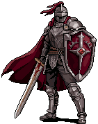

  

  # Taskbar Hero Notifier & Dashboard
  
  **Официальный репозиторий готовых релизов утилиты мониторинга игры Taskbar Hero (Steam)**
  
   

---

## 🎮 О программе / Overview

**Taskbar Hero Notifier** — это утилита и интерактивная веб-панель мониторинга для автоматизации и анализа прогресса в игре **Taskbar Hero** (Steam). 
Программа работает локально в фоновом режиме, безопасно считывает файл сохранения игры `SaveFile_Live.es3` в реальном времени и выводит всю нужную информацию на красивый, современный дашборд, а также отправляет важные оповещения в Telegram.

---

## ✨ Ключевые возможности / Key Features

### 📊 1. Интерактивный Дашборд (Live Dashboard)
* **Состояние Героев**: Отслеживание уровней, опыта (XP) и активности всех 6 персонажей (Рыцарь, Рейнджер, Маг, Жрец, Убийца, Охотник).
* **Сессионный анализ**: Расчет скорости получения опыта (XP/час) и золота (Gold/час) для оптимизации фарма.
* **Статистика карт**: Сбор детальной информации о прохождении локаций — количество зачисток, среднее время рана и рекорды скоростного прохождения.

### 🎒 2. Менеджер Инвентаря и Цен рынка (Inventory & Net Worth)
* **Просмотр сундука и сумки**: Полный список всех предметов в вашем глобальном хранилище и инвентаре с фильтрацией по редкости.
* **Просмотр экипировки**: Наглядное отображение надетых предметов героев, включая инкрустированные руны, свитки и их тиры.
* **Интеграция с рынком**: Подтягивание актуальных цен предметов с базы данных `taskbarherodb.com`. Отображение общей чистой стоимости персонажа (Net Worth).

### 📱 3. Умные уведомления в Telegram (Telegram Bot Integration)
* **Оповещения о событиях**: Бот пришлет уведомление, если герой получил новый уровень, или если ваши сундуки/сумка заполнены.
* **Сводка экипировки**: Возможность в 1 клик отправить в Telegram красивый скриншот-карточку вашей текущей экипировки и текстовую сводку характеристик.
* **Поддержка нескольких окон**: Возможность привязать несколько игровых клиентов к одному Telegram-аккаунту благодаря уникальным тегам устройств.
* **Прямые ссылки в Steam (Новинка!)**: Названия предметов и вставленных в них материалов в Telegram-сообщении кликабельны и открывают Торговую площадку напрямую в приложении Steam на вашем ПК или телефоне!

### 🛑 4. Автоматизация и управление (Control & Auto-actions)
* **Авто-закрытие игры**: Функция автоматического закрытия процесса `TaskBarHero.exe` при переполнении сумки или сундуков для сохранения эффективности фарма.
* **Быстрый запуск**: Запуск и закрытие игры прямо из интерфейса дашборда.

### 🔄 5. Фоновые автообновления (Auto-updates)
* Утилита автоматически проверяет наличие новых версий на GitHub, скачивает обновление с индикацией прогресса и самостоятельно перезапускается.

---

## 🚀 Как начать пользоваться / How to Start

1. Перейдите в раздел **[Releases (Релизы)](https://github.com/Niobiumru/tbh-releases/releases/latest)**.
2. Скачайте последнюю версию файла `tbh_notifier_vX.Y.Z.exe` (или `tbh_notifier_debug_vX.Y.Z.exe`, если вам нужна консоль отладки).
3. Запустите скачанный файл (сама игра Taskbar Hero должна быть запущена хотя бы раз на вашем ПК).
4. Программа автоматически откроет веб-панель мониторинга в вашем браузере по адресу: [http://localhost:5000](http://localhost:5000).

---

## 📱 Настройка Telegram / Telegram Bot Setup

1. Найдите официального бота **[@BotFather](https://t.me/BotFather)** в Telegram.
2. Запустите его, отправьте команду `/newbot` и следуйте инструкциям для создания бота.
3. Скопируйте полученный **Токен бота (Bot Token)** (вида `123456789:ABCDefGh...`).
4. Откройте диалог с вашим созданным ботом и нажмите кнопку **Запустить (Start)**.
5. Перейдите в настройки веб-панели мониторинга (вкладка Telegram внизу страницы), вставьте **Токен** и нажмите кнопку **Привязать**.
6. Для проверки нажмите кнопку **Отправить тестовое уведомление**.

---

> **Важная информация:** Этот репозиторий содержит готовые скомпилированные релизы приложения. Если вы хотите изучить исходный код проекта или принять участие в его разработке, добро пожаловать в главный рабочий репозиторий: **[Niobiumru/tbh](https://github.com/Niobiumru/tbh)**.
